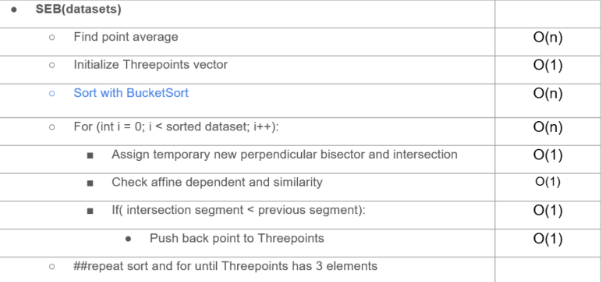

# Smallest Enclosing Ball Problem (Geometric Approach)

Implementation of Smallest Enclosing Ball Problem in C++, with Visualization and Point Generation using Python. 
Here we compared the geometric approach, which uses perpendicular bisectors, in regards to Fischer’s approach (https://github.com/hbf/miniball), which uses a dot-product approach.

The SEB algorithm also has a runtime of O(n), which is represented by the Time Complexity Analysis below.

# How to run the code
Important:  Delete the existing "data.txt" file before generating a new one! 
1. Run the python point generator that you desire. (change the n to get more points)
3. Run the readme.md in Ubuntu with "make".
4. Run the exe that was generated in the src directory with "./program".
5. In order to visualize the data, run the display.py file.

# Contribution Roles

## Conceptualization:
Dexter: Read the research paper and helped bring up the geometric method, also helped in deciphering the pseudocode

Marco: Read the research paper and helped decipher the pseudocode into practical format

## Data curation:
Dexter: Implemented the data generators in python that can output 3 different kinds of distribution.

Marco: Implemented a python code to display the results

## Formal analysis:
Dexter: Implemented the geometric method to solve the SEB problem, as well as conducted tests to check for correctness. 

## Resources:
Matthias Mnich

## Investigation:
Dexter: Generated the datasets and ran the executables in Ubuntu for both the SEB and Fischer’s algorithm.

## Methodology:
Dexter: Implemented the main functions like the coordinate_placeholders and also the affinity_checks etc.

Marco: Implemented functions like the error margin, the point_sorter function etc.

## Project administration:
Matthias Mnich

## Software
Dexter: Created the foundational code for the project and its rough implementation from the pseudocode,

Marco: Helped optimize and improve the runtime of the algorithm.

## Supervision:
Matthias Mnich

## Validation:
Dexter: Checked the correctness of the data from the experiment results.

Marco: Checked the correctness of the data from the experiment results.

## Visualization: 
Dexter: Helped make the dataset tables and graphs to showcase runtimes for both algorithms

Marco: Implemented a visualizer for the generated points in python

## Writing – original draft
Dexter

Marco

## Writing – review & editing
Dexter

Marco
